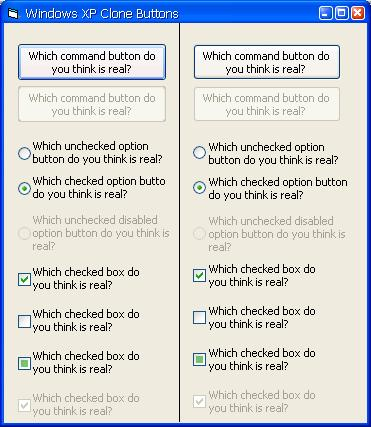



## Windows XP clone command buttons, option buttons, and check boxes\.\-\- MAJOR UPDATE\!\!\! \(finally\)

### Description

I'm finally updating this submission! I have completely redone all three controls. The command button is more richer, has more of the "feel" of the acutal Windows XP command button. I noticed previously it flickered, not anymore! I'm completely drawing these buttons to the user control, so there is no flicker. I was also using a timer to detect when a mouse entered and exited the control, which was a bad idea. I'm now using a different method. On these controls you can set the ForeColor, BackColor, and Font properties. Responds just like actual Windows XP buttons. This is a major improvement from my last submission. Well anyway, hope you enjoy these, now everybody can take advantage of the appealing Windows XP look.

NOTE: In the screenshot, the controls on the left are the cloned ones :-) Can't really tell a difference, can ya?
 
### More Info
 

             |
---                |---
**Submitted On**   |2002-10-06 21:14:58
**By**             |[Andrew Christiansen](https://github.com/Planet-Source-Code/PSCIndex/blob/master/ByAuthor/andrew-christiansen.md)
**Level**          |Intermediate
**User Rating**    |4.8 (38 globes from 8 users)
**Compatibility**  |VB 4\.0 \(16\-bit\), VB 4\.0 \(32\-bit\), VB 5\.0, VB 6\.0
**Category**       |[Custom Controls/ Forms/  Menus](https://github.com/Planet-Source-Code/PSCIndex/blob/master/ByCategory/custom-controls-forms-menus__1-4.md)
**World**          |[Visual Basic](https://github.com/Planet-Source-Code/PSCIndex/blob/master/ByWorld/visual-basic.md)
**Archive File**   |[Windows\_XP1416741062002\.zip](https://github.com/Planet-Source-Code/andrew-christiansen-windows-xp-clone-command-buttons-option-buttons-and-check-boxes-major-__1-30397/archive/master.zip)

